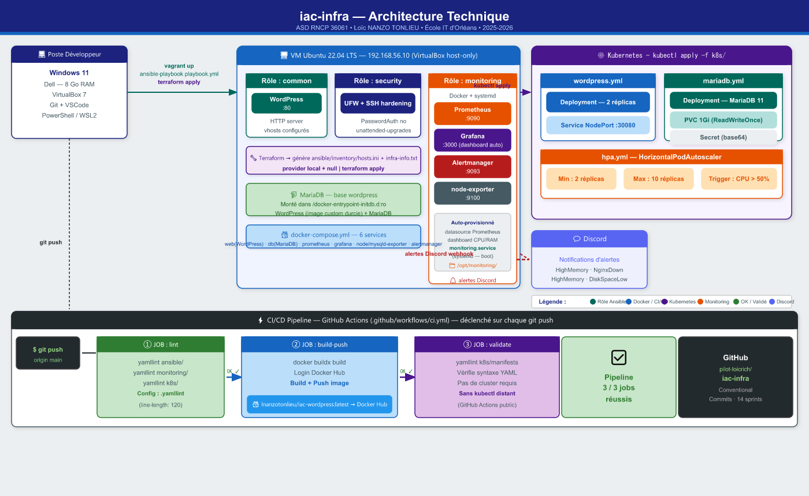

# iac-infra

Infrastructure as Code — Administrateur Système DevOps (RNCP 36061)

## Description

Ce projet déploie une **application réelle — WordPress** — dans une infrastructure
entièrement automatisée, hautement disponible et supervisée :

- **Vagrant** : provisioning de VMs locales (Ubuntu 22.04)
- **Ansible** : configuration automatisée (base, sécurité, monitoring, déploiement WordPress)
- **Terraform** : Infrastructure as Code (génération inventaire + infra-info.txt)
- **Docker / Docker Compose** : WordPress + MariaDB + stack monitoring
- **Kubernetes** : orchestration haute dispo (WordPress 2 réplicas + MariaDB + HPA + PVC + Secrets)
- **GitHub Actions** : pipeline CI/CD (lint → build → push → validate)

L'application déployée est **WordPress** (CMS PHP) adossé à une base **MariaDB**,
conteneurisée à partir d'une **image WordPress custom durcie** (limites PHP de
production + interdiction de l'édition de fichiers depuis l'admin).

## Architecture



> Schéma complet : VM Ubuntu (WordPress + MariaDB + Security + Monitoring via Ansible) · Kubernetes (Deployment + PVC + HPA + Secret) · CI/CD GitHub Actions · Alertmanager → Discord

<details>
<summary>Vue ASCII (alternative texte)</summary>

```
[ Poste développeur — Windows 11 ]
      |
      | vagrant up / ansible-playbook / terraform apply
      v
[ VM Ubuntu 22.04 — 192.168.56.10 (VirtualBox host-only) ]
  +-- WordPress + MariaDB (Docker)        ← rôle Ansible : webapp
  +-- UFW + SSH hardening                ← rôle Ansible : security
  +-- Stack monitoring (Docker)          ← rôle Ansible : monitoring
        +-- Prometheus    (port 9090)
        +-- Grafana       (port 3000)    ← dashboard auto-provisionné
        +-- Alertmanager  (port 9093)    → Discord webhook
        +-- node-exporter (port 9100)
        +-- mysqld-exporter (port 9104)  ← métriques base WordPress

[ Kubernetes — kubectl apply -f kubernetes/ ]
  +-- WordPress Deployment (2 réplicas) + Service NodePort :30080
  +-- MariaDB Deployment + PVC 1Gi + Secret
  +-- WordPress PVC 2Gi (wp-content persistant)
  +-- HPA : autoscaling 2-10 réplicas (CPU > 50%)

[ CI/CD — GitHub Actions ]
  lint (yamllint) → build+push image WordPress custom (Docker Hub) → validate (yamllint k8s)
```

</details>

## Prérequis

- VirtualBox 7.x
- Vagrant 2.4.x
- Terraform 1.14.x
- Docker + Docker Compose v2
- kubectl (pour Kubernetes)

## Démarrage rapide

### 1. Infrastructure VM (Vagrant + Ansible)

```bash
vagrant up
```

Cela provisionne la VM et exécute le playbook Ansible qui installe :
- Outils de base + Docker
- UFW (pare-feu) + SSH hardening
- Stack monitoring complète (Prometheus, Grafana, Alertmanager, node-exporter)
- **WordPress + MariaDB** (rôle `webapp`)

```bash
# Vérifier WordPress
curl http://192.168.56.10

# Détruire la VM
vagrant destroy -f
```

### 2. Environnement de développement (Docker Compose)

Créer un fichier `.env` à la racine :

```env
MARIADB_ROOT_PASSWORD=root_pass_secret
MARIADB_DATABASE=wordpress
MARIADB_USER=wp_user
MARIADB_PASSWORD=wp_pass_secret

WORDPRESS_DB_HOST=db:3306
WORDPRESS_DB_NAME=wordpress
WORDPRESS_DB_USER=wp_user
WORDPRESS_DB_PASSWORD=wp_pass_secret
```

```bash
# Démarrer tous les services (WordPress + MariaDB + monitoring)
docker compose up -d --build

# Vérifier les services
docker compose ps
```

Services disponibles :

| Service         | URL                            |
|-----------------|--------------------------------|
| WordPress       | http://localhost:8080          |
| MariaDB         | localhost:3307                 |
| Prometheus      | http://localhost:9090          |
| Grafana         | http://localhost:3000          |
| Alertmanager    | http://localhost:9093          |
| node-exporter   | http://localhost:9100/metrics  |
| mysqld-exporter | http://localhost:9104/metrics  |

Au premier accès à http://localhost:8080, l'assistant d'installation WordPress
se lance ; choisir la langue, le titre du site et créer le compte administrateur.

### 3. Terraform

```bash
cd terraform
terraform init
terraform plan
terraform apply
```

Génère `ansible/inventory/hosts.ini` et `infra-info.txt`.

## Supervision & Alertes

### Accès Grafana

```
URL      : http://192.168.56.10:3000  (VM)  ou  http://localhost:3000  (dev)
Login    : admin
Mot de passe : admin
```

Le dashboard **Infrastructure** est provisionné automatiquement au démarrage avec 3 panels :
- CPU Usage (%)
- RAM Usage (%)
- Uptime (secondes)

Les métriques de la base WordPress sont collectées via **mysqld-exporter** (job `mysqld`).

### Alertes Prometheus

Trois alertes sont configurées dans [monitoring/alerts.yml](monitoring/alerts.yml) :

| Alerte          | Seuil              | Sévérité |
|-----------------|--------------------|----------|
| HighCPUUsage    | CPU > 80% / 2 min  | warning  |
| HighMemoryUsage | RAM > 85% / 2 min  | critical |
| InstanceDown    | node_exporter down | critical |

### Notifications Discord (Alertmanager + relay)

Les alertes sont envoyées sur Discord. Alertmanager pousse un webhook vers un
**micro-relay Python** ([discord_relay.py](discord_relay.py), port 9094) qui traduit
le JSON Alertmanager au format natif Discord.

Tester une alerte de bout en bout :

```bash
# Arrêter node-exporter pour déclencher NginxDown
docker compose stop node-exporter

# Vérifier dans Prometheus : http://localhost:9090/alerts
# Attendre ~1 minute → l'alerte arrive sur Discord (HTTP 204)
docker compose start node-exporter
```

## Base de données WordPress (MariaDB)

La base `wordpress` est créée automatiquement au premier démarrage de MariaDB
(variables `MARIADB_*` du `.env`). WordPress crée son propre schéma à l'installation.

### Vérification

```bash
docker compose exec db sh -c 'mariadb -uroot -p"$MARIADB_ROOT_PASSWORD" -e "SHOW TABLES;" wordpress'
```

### Sauvegarde / Restauration

```bash
# Sauvegarder (mysqldump)
./scripts/backup-mariadb.sh

# Restaurer depuis le dernier backup
./scripts/backup-mariadb.sh restore
```

### Réinitialiser

```bash
docker compose down -v          # supprime les volumes mariadb_data et wp_data
docker compose up -d --build
```

## Déploiement Kubernetes (haute disponibilité)

```bash
kubectl apply -f kubernetes/wordpress-secret.yml
kubectl apply -f kubernetes/mariadb.yml
kubectl apply -f kubernetes/wordpress.yml
kubectl apply -f kubernetes/hpa.yml

# Vérifier
kubectl get pods,svc,pvc,hpa
```

- **WordPress** : 2 réplicas, Service NodePort `:30080`, PVC 2Gi pour `wp-content`
- **MariaDB** : PVC 1Gi (données persistantes), identifiants via Secret
- **HPA** : autoscaling 2 → 10 réplicas (seuil CPU 50%)

## Pipeline CI/CD

Le pipeline [.github/workflows/ci.yml](.github/workflows/ci.yml) exécute automatiquement à chaque push :

1. **Lint YAML** — validation des fichiers YAML (`ansible/`)
2. **Lint Terraform** — `terraform init` + `terraform validate`
3. **Build Docker** — build de l'image **WordPress custom** (`docker/Dockerfile`)
4. **Push Docker Hub** — push de l'image `iac-wordpress` (sur `main` uniquement)
5. **Validate Kubernetes** — validation des manifests K8s

## Compétences RNCP couvertes

| Bloc | Compétence | Couvert par |
|------|-----------|------------|
| BC01-CP1 | Scripts Bash | `scripts/setup.sh`, `scripts/backup-mariadb.sh` |
| BC01-CP2 | IaC | Terraform + Ansible (4 rôles : common/security/monitoring/webapp) |
| BC01-CP3 | Sécurité | UFW, SSH hardening, gestion des secrets (Ansible Vault / Secret K8s injecté hors dépôt, `.env` gitignoré), image WordPress durcie |
| BC01-CP4 | Mise en prod | Vagrant + Ansible (déploiement WordPress) + Kubernetes |
| BC02-CP1 | Env de test | Docker Compose (WordPress + MariaDB + monitoring) |
| BC02-CP2 | Stockage | PVC MariaDB + PVC wp-content (WordPress) |
| BC02-CP3 | Conteneurs | Image WordPress custom durcie (Dockerfile) |
| BC02-CP4 | CI/CD | GitHub Actions : lint → build → push → validate |
| BC03-CP1 | KPI | Alertes Prometheus (CPU, mémoire, service down) |
| BC03-CP2 | Supervision | Prometheus + Grafana + mysqld-exporter + Alertmanager → Discord |
| BC03-CP3 | Anglais | Documentation technique (commits, CI, code) |

## Limites connues & axes de production

Ce projet est un **lab** : certains choix sont assumés et seraient renforcés en production.

- **Secrets** : les valeurs du `.env` et des `defaults` Ansible sont des secrets de
  lab. En production : **Ansible Vault** (chiffrement), Secret Kubernetes généré hors
  dépôt (`kubectl create secret`, Sealed Secrets / External Secrets / Vault).
- **TLS / HTTPS** : non activé en local. En production : **cert-manager + Let's Encrypt**
  sur un Ingress Kubernetes (ou reverse-proxy avec certificat).
- **Terraform** : ici il génère uniquement l'inventaire Ansible et `infra-info.txt`.
  C'est **Ansible** qui porte la configuration. Pour une vraie infra cloud, Terraform
  provisionnerait les ressources (VPC, instances, etc.).
- **Stockage WordPress en K8s** : le PVC `wp-content` est en ReadWriteOnce (mono-nœud).
  Pour plusieurs réplicas sur plusieurs nœuds : stockage **ReadWriteMany** (NFS) ou
  objet (S3) pour les médias.
- **CI** : la validation Kubernetes inclut un scan de configuration **Trivy**
  (manifests + Dockerfile) en complément de yamllint.

## Auteur

Loïc NANZO TONLIEU — Formation ASD RNCP 36061
